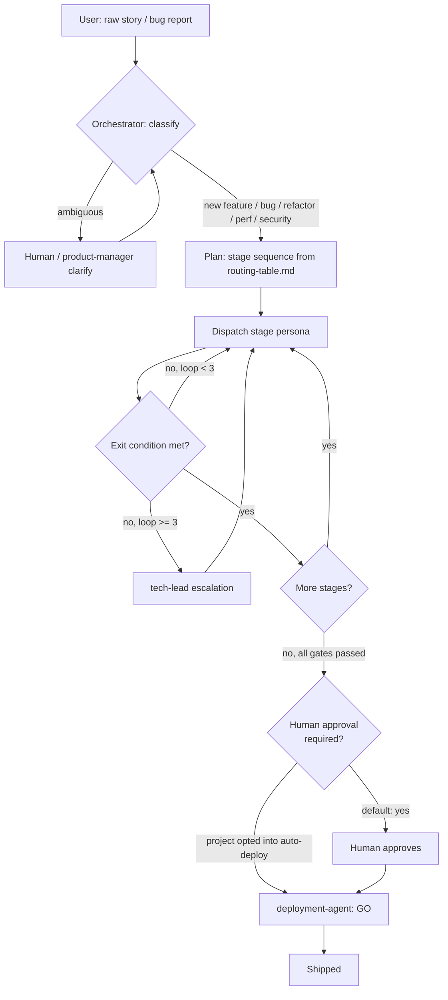

# Autonomous Orchestration

This directory holds the Orchestrator's routing logic, state machine, and the workflow-state file format. It's the concrete "engine" behind the `orchestrator` persona ([agents/orchestrator.md](../agents/orchestrator.md)) and the `autonomous-orchestration` skill ([skills/autonomous-orchestration/SKILL.md](../skills/autonomous-orchestration/SKILL.md)).

- **[routing-table.md](routing-table.md)** — which personas own which stage, per request classification.
- **[orchestrator-state-machine.md](orchestrator-state-machine.md)** — the states, loop policy, and escalation rules.
- **[workflow-state.schema.json](workflow-state.schema.json)** — the schema for the living state file the Orchestrator reads/writes at every transition.

See [AGENTS.md](../AGENTS.md#autonomous-orchestration-mode) for how this mode is triggered, and [docs/agents.md](../docs/agents.md#autonomous-orchestration-the-one-exception) for how it relates to (and deliberately overrides) the pack's default "personas don't call personas" rule.

## How this differs from the pack's other orchestration patterns

Every other pattern in [references/orchestration-patterns.md](../references/orchestration-patterns.md) keeps the user (or a single slash command turn) as the orchestrator. This mode is different on purpose: the `orchestrator` persona itself holds composition authority across many turns, with three concrete guardrails standing in for the human checkpoints a purely manual pipeline would otherwise provide:

1. **A persisted, append-only state file** instead of an agent's summary — the audit trail survives even if a later turn misremembers what happened three stages ago.
2. **A bounded loop count with mandatory escalation** — no failure mode where the Orchestrator just keeps retrying forever.
3. **A configurable human checkpoint before the final Ship stage** — autonomy up to "ready to ship" by default; the last step still asks, unless a project explicitly opts into auto-deploy.

## Diagram: the shape of one run

## Worked example 1: new user story

**Input** (pasted with no persona or command named):

> As a shopper, I want to save items to a wishlist so I can find them again later without re-searching.

**Run:**

1. **Classify** → New Feature / User Story. Not ambiguous — has a clear actor, action, and reason.
2. **Plan** (from `routing-table.md`): `requirements-agent` ∥ `product-manager` → `architecture-agent` → `backend-developer` + `frontend-developer` + `database-agent` → `code-reviewer` → `test-engineer` → `deployment-agent`.
3. `workflow-state.json` initialized with this plan, `status: in-progress`.
4. `requirements-agent` produces functional requirements (add/remove/list wishlist items, persisted per user) and non-functional ones (must work for a logged-out-then-logged-in user — flags this as an open question). `product-manager` in parallel writes acceptance criteria and confirms MVP scope excludes wishlist sharing.
5. Orchestrator resolves the open question by scoping it out explicitly (logged-out wishlists deferred), records it as a blocker resolved by scope decision, and advances.
6. `architecture-agent` designs the `wishlist_items` table (handed to `database-agent`), the `POST/DELETE /wishlist` + `GET /wishlist` contract (handed to `backend-developer`), and the wishlist button + page (handed to `frontend-developer`). Flags: no auth/payments risk beyond existing session auth — no dedicated security gate required beyond the standard review pass.
7. `database-agent` writes the migration; `backend-developer` and `frontend-developer` implement against the contract, each self-checking before reporting done.
8. `code-reviewer` finds a missing empty-state on the wishlist page → **REQUEST CHANGES**. Orchestrator routes this back to `frontend-developer` (loop count: 1/3), re-dispatches review after the fix. LGTM on the second pass.
9. `test-engineer` finds the DELETE endpoint doesn't 404 on an already-removed item → **bug found**. Routes back to `backend-developer` (loop count: 1/3), re-tests after the fix. Signs off.
10. All gates pass (no security/performance gate was flagged, so none are required). Status → `ready-to-ship`.
11. No project auto-deploy policy is set, so the Orchestrator requests human approval before dispatching `deployment-agent`. On approval, `deployment-agent` verifies the evidence trail, writes the rollout/rollback plan, and issues **GO**.

## Worked example 2: bug fix

**Input:**

> Checkout occasionally hangs for ~30 seconds before completing. Started after last week's release. No errors in logs.

**Run:**

1. **Classify** → Bug Fix.
2. **Plan**: `debugger` → developer persona debugger recommends → `code-reviewer` → `test-engineer` → `deployment-agent`.
3. `debugger` reproduces the hang locally, writes a failing test that demonstrates a race between the payment-confirmation call and an auth refresh, and recommends `backend-developer` as owner.
4. `backend-developer` sequences the two calls instead of racing them, confirms the new failing test now passes.
5. `code-reviewer` approves (LGTM) on the first pass.
6. `test-engineer` runs the fix under the repro conditions 20 times to confirm the hang doesn't recur intermittently — signs off.
7. This touches the payment-confirmation path, so `architecture-agent`'s standing risk flag for payments applies retroactively: Orchestrator dispatches `security-auditor` as a gate even though the classification was Bug Fix, not Security. Pass.
8. All gates pass. Human approval requested (default policy) → approved → `deployment-agent` issues GO with a rollback plan keyed to the previous release tag.

Both examples show the same shape: classify once, loop only where a gate actually fails, escalate instead of retrying past the limit, and never skip the final checkpoint unless the project explicitly said to.
